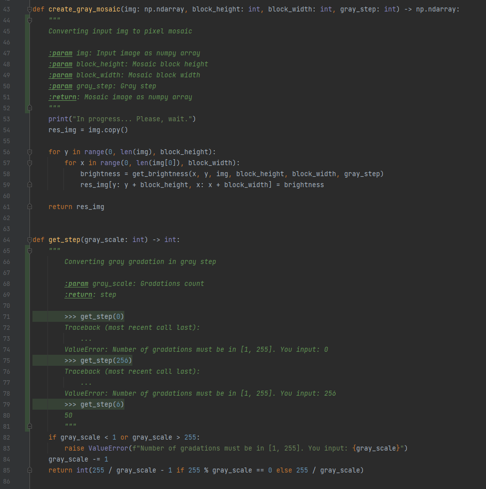

# Задание по теме №10 "PyCharm"
# Сравнение времени выполнения
5) Профилировщик для [нового filter.py](filter.py)

6) Профилировщик для [старого old_filter.py](old_filter.py)

__Пояснение к 5 и 6 пунктам__
   * 1.  Основное время выполнения [нового фильтра](filter.py) составил ввод данных. Если вычесть из общего времени выолнения (15183мс) время ввода (14624), то получится 559мс, что быстрее почти в 7 раз чем [старый фильтр](old_filter.py).
   * 2.  Это обусловленно исправлением ошибки переполнения и использоввания встроенных методов numpy вместо вложенных циклов python.
7) Профилировщик для [нового filter.py без ввода](filter_with_filename.py)

__Пояснение к 7 пункту__
   * 1. Результат выполнения ~= тому что я написал в пункте 'a' в пояснении к 5 и 6 пунктам
   * 2. Объяснение этому так же написано в пункте 'b' в пояснении к 5 и 6 пунктам
# До/После
8) 
   1) Изображение до преобразования

   2) После обработки [старым фильтром](old_filter.py)

   3) После обработки [новым фильтром](filter.py)

# Коментарии и тесты
11) Некоторые функции нельзя протестировать из-за возвращаемого/вводимого значения в виде объекта numpy

# Отладка
12) Весь проект уже в PEP8
13) Значения размеров блока мозайки и количество градаций серого отдельным скринщотом, т.к. ввод идёт напрямую при вызове функции

